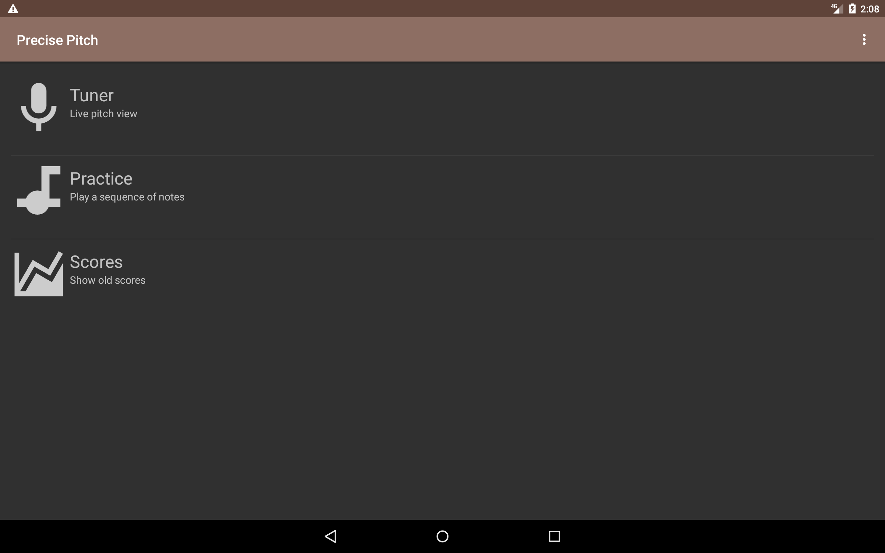
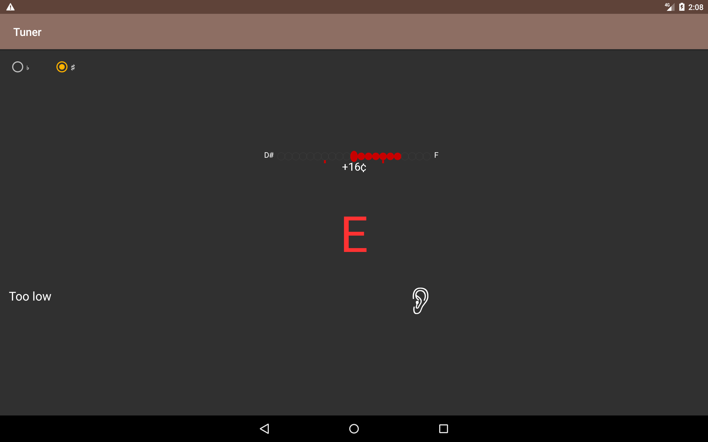
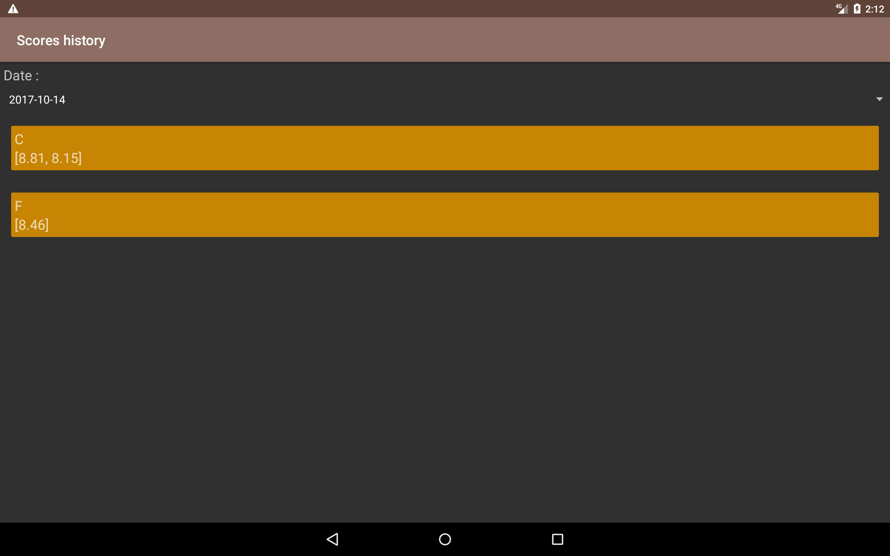
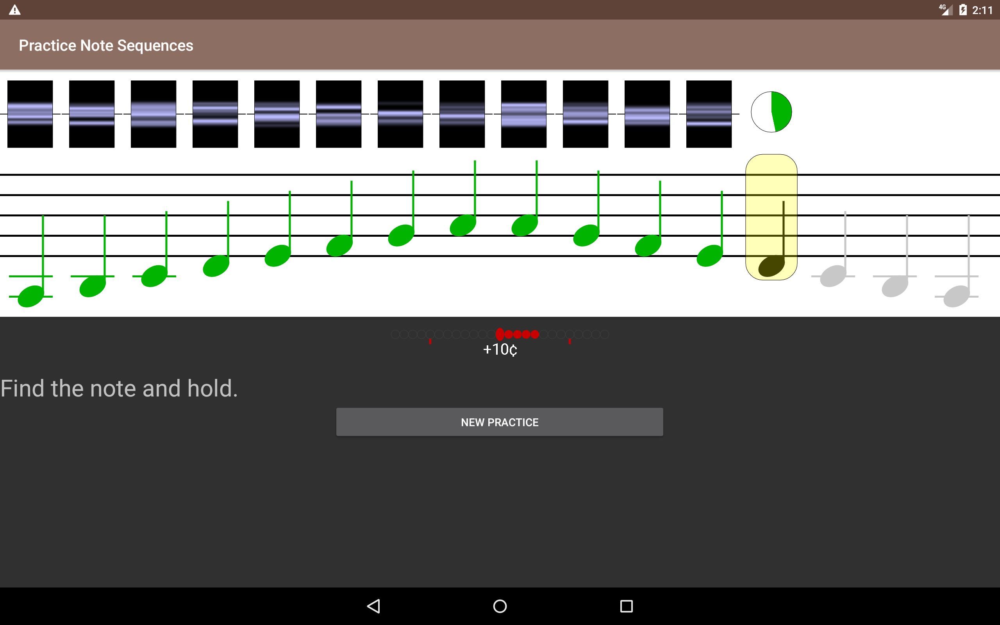

 Precise Pitch
---------------------

Forked project (orgini : https://github.com/hzeller/precise-pitch) thanks a lot to hZeller
This serious game give you an opportunity to learn easily the cello.
Play with your teacher or other students.

You can build this app with Gradle (just like that : ./gradlew buil)
Or you can find a daily build here : http://jenkins.nuxlight.xyz/job/PrecisePitch-DailyBuild/

## Screens

### The home activity

### The tuner activity

### The score activity

### The practice activity

[icon]: ./res/drawable-mdpi/ic_launcher_pp.png
